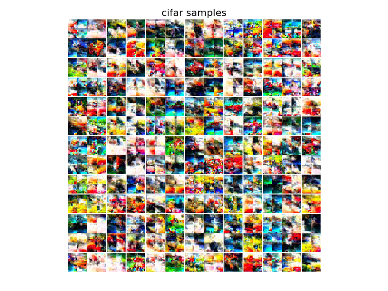
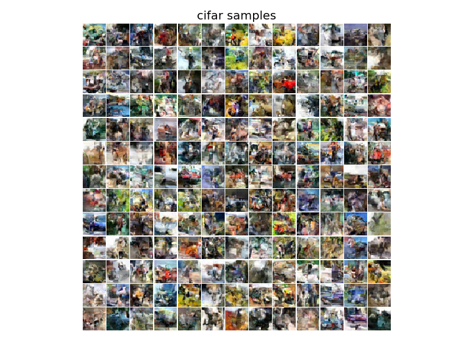
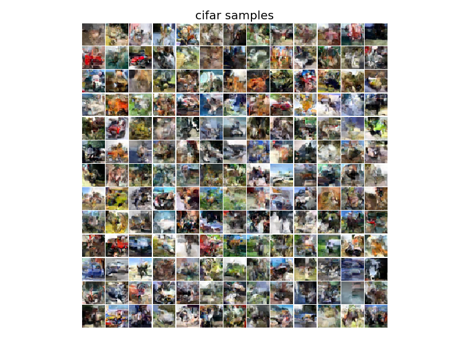
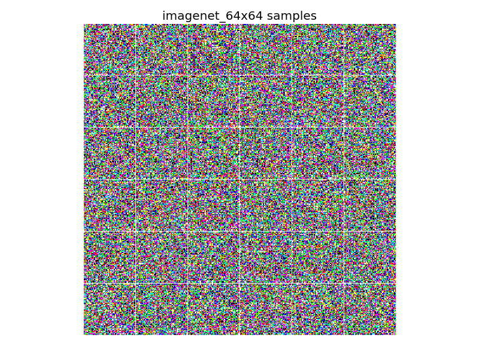
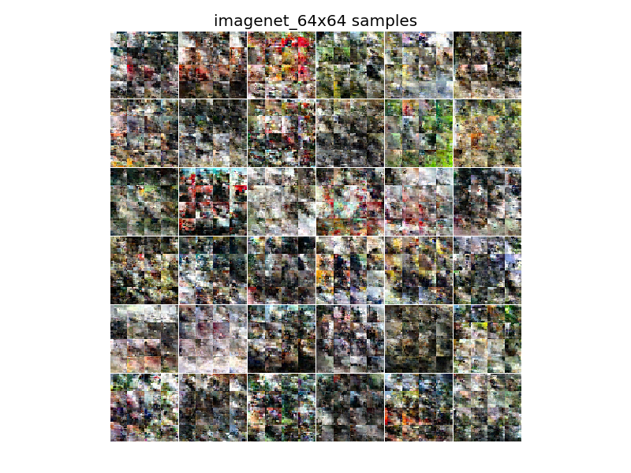
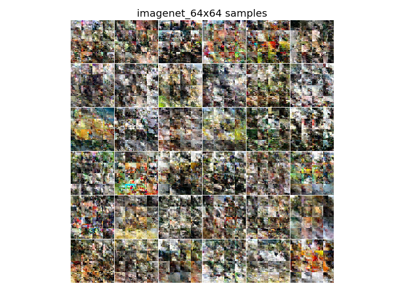
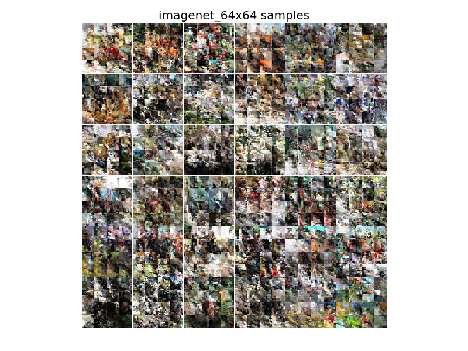

# Large image Pixel-cnn

Why not predict multiple pixels at the same time! In this repo we adapt the beautifully written Pixel-Cnn++ code to predict multiple pixels at the same time. This has two benefits. First, it allows images to be sampled much much faster. Second, it allow larger images to be generated.


# Related Work!

Well google had this same idea but much much better [here](https://arxiv.org/pdf/1703.03664.pdf). Technically my repo predates their archive submission so really they stole my idea. Just Joking. The above paper is so full of good new ideas that its a crazy they can fit it in only 8 pages (well 16 really).

# Breaking up the image

We slice up the image into equal sized chunks. These chunks are concatenated together and treated as an image with depth `3n`  where `n` is the number of chunks. The normal PixelCNN is run on these altered images.

# How to run the code

Running the code is the same as the Pixel-Cnn repo however now you can run on imagenet 64x64 and specify the number of splits to the image. Here is an example call.

```
python train.py --nr_gpu=1 --data_set=imagenet_64x64 --nr_split=4
```

One thing to keep in mind is this does not load the entire imagenet data set but only an 8th of it. This is to reduce the RAM usage when training.

# Cifar 4 slices

Here are a few sampled images during training of 32x32 cifar with 2x2 slices.

Step 0

Step 30

Step 90

Step 161


# Imagenet 64x64

Here are a few sampled images during training of 64x64 imagenet with 4x4 slices.

Step 0

Step 30

Step 60

Step 90


# Results

For the most part this method works really well. The network trains quickly and sampling time is cut proportional to the number of slices. The only draw back is small boundary effects that emerge on the boundaries of the splits. This don't seem to be too bad after training for many steps though.


